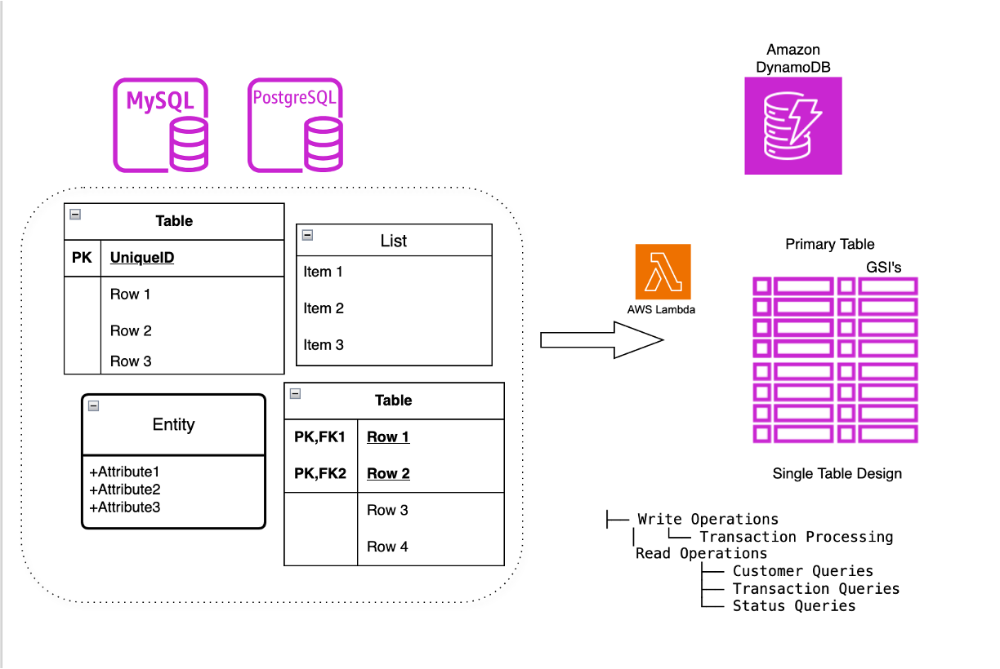

# DynamoDB DataModel

A data modeling solution for Amazon DynamoDB that simplifies working with single-table design patterns.

## Data Model Diagram



## Getting Started

This repository contains CloudFormation templates and code examples for implementing efficient DynamoDB data models.

### Add your files

```bash
# Create or upload files
# Add files using the command line or push an existing Git repository with the following command:

cd existing_repo
git remote add origin https://gitlab.aws.dev/sjjajoo/dynamo-db-datamodel.git
git branch -M main
git push -uf origin main
```

### Project Structure

- `CloudFormation Template/` - Contains AWS CloudFormation templates for DynamoDB resources
  - `transaction-system.yaml` - Template for transaction processing system with DynamoDB and Lambda

### Features

- Single-table design patterns for DynamoDB
- Transaction processing system with Lambda integration
- Efficient data access patterns using GSIs
- Complete CloudFormation templates for infrastructure as code

### Installation

1. Clone the repository:
```bash
git clone https://gitlab.aws.dev/sjjajoo/dynamo-db-datamodel.git
cd dynamo-db-datamodel
```

2. Deploy the CloudFormation template:
```bash
aws cloudformation deploy \
  --template-file "CloudFormation Template/transaction-system.yaml" \
  --stack-name transaction-system \
  --parameter-overrides Environment=dev \
  --capabilities CAPABILITY_IAM
```

### Usage

The transaction system provides several operations:

- Create transactions
- Record transaction events
- Create delivery records
- Update delivery status

Example Lambda invocation:

```json
{
  "body": {
    "operation": "create_transaction",
    "data": {
      "customer_id": "12345",
      "transaction_type": "PURCHASE",
      "status": "PENDING",
      "event": {
        "event_name": "TRANSACTION_CREATED",
        "message": "Transaction initiated"
      }
    }
  }
}
```

### Test Queries

After deploying the CloudFormation stack, you can test the Lambda function with the following curl commands:

#### 1. Create a Transaction

```bash
curl -X POST https://{api-id}.execute-api.{region}.amazonaws.com/dev/transactions \
  -H "Content-Type: application/json" \
  -d '{
    "operation": "create_transaction",
    "data": {
      "customer_id": "12345",
      "transaction_type": "PURCHASE",
      "status": "PENDING"
    }
  }'
```
**Explanation**: Creates a new transaction record with a unique transaction ID and delivery ID. The record is stored with a primary key of `TRANS#{transaction_id}` and sort key of `METADATA`.

#### 2. Create a Transaction with Event

```bash
curl -X POST https://{api-id}.execute-api.{region}.amazonaws.com/dev/transactions \
  -H "Content-Type: application/json" \
  -d '{
    "operation": "create_transaction",
    "data": {
      "customer_id": "12345",
      "transaction_type": "PURCHASE",
      "status": "PENDING",
      "event": {
        "event_name": "TRANSACTION_CREATED",
        "message": "Transaction initiated"
      }
    }
  }'
```
**Explanation**: Creates both a transaction record and an associated event record in a single operation. The event is linked to the transaction using the same transaction ID.

#### 3. Create an Event for an Existing Transaction

```bash
curl -X POST https://{api-id}.execute-api.{region}.amazonaws.com/dev/transactions \
  -H "Content-Type: application/json" \
  -d '{
    "operation": "create_event",
    "data": {
      "transaction_id": "{transaction_id}",
      "event_name": "PAYMENT_PROCESSED",
      "message": "Payment successfully processed"
    }
  }'
```
**Explanation**: Adds a new event to an existing transaction. The event is stored with primary key `TRANS#{transaction_id}` and sort key `EVENT#{timestamp}`.

#### 4. Create a Delivery Record

```bash
curl -X POST https://{api-id}.execute-api.{region}.amazonaws.com/dev/transactions \
  -H "Content-Type: application/json" \
  -d '{
    "operation": "create_delivery",
    "data": {
      "delivery_id": "{delivery_id}",
      "transaction_id": "{transaction_id}",
      "request_xml": "<request>...</request>",
      "response_xml": "<response>...</response>"
    }
  }'
```
**Explanation**: Creates a delivery record linked to a transaction. The delivery record is stored with primary key `DEL#{delivery_id}` and sort key `METADATA`, with a GSI1 entry that allows querying by transaction ID.

#### 5. Update Delivery Status

```bash
curl -X POST https://{api-id}.execute-api.{region}.amazonaws.com/dev/transactions \
  -H "Content-Type: application/json" \
  -d '{
    "operation": "update_delivery_status",
    "data": {
      "delivery_id": "{delivery_id}",
      "status": "DELIVERED"
    }
  }'
```
**Explanation**: Updates the status of a delivery. Creates a record with primary key `DEL#{delivery_id}` and sort key `STATUS#CURRENT`. The GSI1 allows querying all deliveries with a specific status.

### Data Model

The DynamoDB data model uses the following access patterns:

- PK/SK: Primary key structure for entity relationships
- GSI1: Global Secondary Index for querying by customer, event type, or status

### Support

For support, please open an issue in the GitLab repository or contact the project maintainers.

### Roadmap

- Add additional CloudFormation templates for other common DynamoDB patterns
- Implement utility libraries for working with the data model
- Add example applications demonstrating best practices

### Contributing

Contributions are welcome! Please follow these steps:

1. Fork the repository
2. Create a feature branch
3. Commit your changes
4. Push to the branch
5. Open a merge request

### Authors and Acknowledgment

- Initial development by sjjajoo

### License

Internal use only - not for distribution.

### Project Status

Active development - This project is currently being actively developed and maintained.